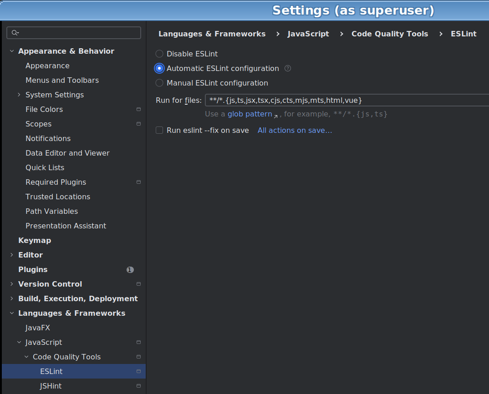

# Guidance For Plugin Maintainers

<!-- TOC:START -->
- [Guidance For Plugin Maintainers](#guidance-for-plugin-maintainers)
  - [Overview](#overview)
  - [First-time setup](#first-time-setup)
  - [Development Stack](#development-stack)
    - [Overview](#overview-1)
    - [Inventory of Technologies](#inventory-of-technologies)
      - [Task Orchestration and Build Caching via NX](#task-orchestration-and-build-caching-via-nx)
      - [Continuous Integration (CI) Via Github Actions](#continuous-integration-ci-via-github-actions)
      - [TypeScript](#typescript)
      - [Node.js](#nodejs)
      - [ESLint](#eslint)
      - [Prettier](#prettier)
      - [Unit Testing via Jest](#unit-testing-via-jest)
      - [Webpack (Test Fixtures)](#webpack-test-fixtures)
    - [IDE Setup (Intellij IDEA)](#ide-setup-intellij-idea)
      - [Incremental Lint'ing](#incremental-linting)
      - [Incremental Code Formatting](#incremental-code-formatting)
  - [Running Samples](#running-samples)
  - [Formatting](#formatting)
  - [Contributing a PR -- OBSOLETE](#contributing-a-pr----obsolete)
<!-- TOC:END -->

## Overview

This page is targeted to developers interested in contributing (features, docs, examples, tests, fixes, etc.) to the
plugin itself, rather than plugin users. All development to date has been done on NiXos Linux (so
MacOS or Windows developers may need to wing it a bit.)

## First-time setup

Run the provided development setup script to install dependencies, compile sources, run
the test-suite, and package the plugin for release.

```sh
git clone git@github.com:buildlackey/gas-demodulify-plugin.git
cd gas-demodulify-plugin
bash ./scripts/dev_setup.sh
```

This will leave the compiled artifacts in `dist/` and produce the packaged plugin under `dist/plugin`
so samples and IDE runners will use the latest compiled code.

## Development Stack

### Overview

This section is intended for contributors and maintainers seeking to
understand the technologies used to
implement, build, package and release the plug-in.

[NX](https://nx.dev/docs/getting-started)
is used to orchestrate build tasks, with a key assumption being that
Lint'ing and type checking will be done within your IDE as you write and test code.
So the NX build [configuration](../project.json)
will check that Lint rules and type checks are not violated (and will fail builds upon
encountering any related errors). However, we shave off some run time by _not_ explicitly
running Lint or type checks as part of the automated build steps. The assumption is that developers will
configure their IDEs as shown [below](#ide-setup-intellij-idea)
to perform Lint'ing and type checking incrementally, as files are viewed and edited.
This saves time when running the automated build steps. Another huge time
saver is the ability of NX to cache the results of the various phases of the build
and avoid re-running any step whose source inputs have not changed.

### Inventory of Technologies

#### Task Orchestration and Build Caching via NX

The [NX](https://nx.dev/docs/getting-started) configuration file
which defines the build targets and their dependencies can be found [here](../project.json), and
the CI build invokes more or less the following steps:

    gas-demodulify-plugin:release
    └─ gas-demodulify-plugin:package
            └─ gas-demodulify-plugin:build
            ├─ gas-demodulify-plugin:lint
            ├─ gas-demodulify-plugin:format
            ├─ gas-demodulify-plugin:toc:check
            └─ gas-demodulify-plugin:test
                └─ gas-demodulify-plugin:compile

#### Continuous Integration (CI) Via Github Actions

The Github repo that contains this plugin's source code has been configured to run
through the CI workflow defined [here](../.github/workflows/ci.yml), on any push to main.
The results of the CI build are viewable [here](https://github.com/datalackey/gas-demodulify-plugin/actions)

#### TypeScript

The plugin is authored in [TypeScript](https://www.typescriptlang.org/).  
Two configurations are used:

- [`tsconfig.build.json`](../tsconfig.build.json) — used for emitting compiled output into `dist/`
- [`tsconfig.typecheck.json`](../tsconfig.typecheck.json) — used in CI to perform full
  type-checking without emitting code

Type-checking is expected to be performed incrementally within the IDE during development.
The CI pipeline enforces correctness by running the `typecheck` target explicitly.

#### Node.js

Development and CI are performed against active LTS versions of Node.js.  
The CI matrix defines the supported versions explicitly (see the [CI workflow file](../.github/workflows/ci.yml)).
Contributors should ensure their local Node version aligns with one of the supported LTS versions.

#### ESLint

[ESLint](https://eslint.org/) statically analyzes your code and nags you when it finds
'code smells' such as 'unsafe any' references, or unused variables. See the config file: [here](../.eslintrc.json).

#### Prettier

[Prettier](https://prettier.io/) automatically formats your code to enforce a consistent style
(indentation, spacing, quotes, etc.) You will not like the coding standards ! And we don't like them either.
But they save an immense amount of time during code reviews as they help us avoid the
cognitive overhead of whitespace and indent based diffs. (Not to mention time save debatting formatting style!)

See the config file: [here](../.prettierrc.json).

#### Unit Testing via Jest

Tests are written in [Jest](https://jestjs.io/), a JavaScript testing framework that provides
fast execution, snapshot support, and a rich assertion API.

We have two categories of tests:

- **End-to-End (E2E) Tests**  
  These validate full transformation flows and integration scenarios (e.g., input → demodulified output).
  They operate off of Webpack configuration file 'fixtures' and verify real-world behavior across multiple modules.  
  See: [`test/end-to-end-transform-to-gas-tests/`](../test/end-to-end-transform-to-gas-tests/)
  These tests require the plugin to be compiled first (via the `compile` target), as they depend on the
  built plugin rather than raw TypeScript source, and our [Jest config](../jest.config.cjs)
  ensures that the plugin is up-to-date before running the tests by calling
  the pre-run [script](../scripts/jest-global-setup.js).


- **Feature / Unit Tests**  
  These target specific internal behaviors (e.g., logging, configuration validators, etc.)
  They are isolated and run directly against the source code without requiring a packaged artifact.  
  See: [`test/`](../test/targeted-feature-tests)
-

#### Webpack (Test Fixtures)

Most e2e tests use minimal [Webpack](https://webpack.js.org/) configurations to simulate real-world bundling
scenarios.  
For example:  [this one](../test/end-to-end-transform-to-gas-tests/fixtures/default-export-gas/webpack.config.js).

### IDE Setup (Intellij IDEA)

#### Incremental Lint'ing

To configure IDEA to run lint checks incrementally as you edit files, bring up the
page below in the Settings Dialog and select 'Automatic ESLint configuration' and 'Run eslint --fix on save'.



This will run lint checks and auto-fix any fixable issues whenever you save a file

#### Incremental Code Formatting

The screenshot below shows how to configure IDEA to run Prettier formatting on save:


$## Build Targets

Here is [the diagram](https://github.com/datalackey/gas-demodulify-plugin/blob/main/docs/nx-build-graph.html)

## Running Samples

Similarly to e2e tests, running code from the `samples/` projects will pick up the generated plugin
package under `dist/plugin` rather than running from the TypeScript source you are editing under `src/`.

requires the plugin from `dist/plugin`, it will pick up the generated package under `dist/plugin` rather than
the TypeScript source you are editing under `src/`.

That means: if you change source files in `src/` and then run tests from your IDE without
rebuilding the packaged plugin, the tests may still exercise the old compiled code under `dist/plugin`.

## Formatting

Code is formatted as part of the release process, so you should not depend on any manual formatting you do in your IDE.

`npm run build` will reformat your code.

`npm run package:release` will fail if formatting is not compliant.

## Contributing a PR -- OBSOLETE

CI runs `npm run package:release` on all supported Node LTS versions.
PRs must pass on all matrix entries before merge.
